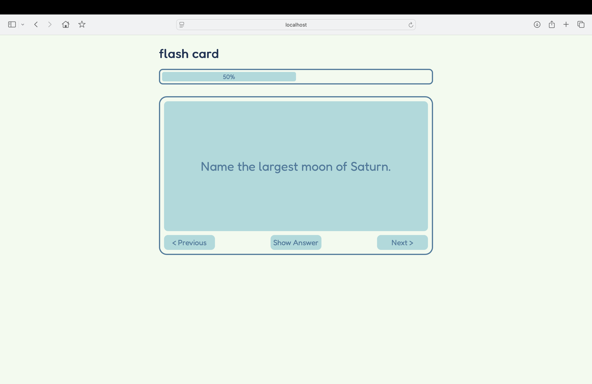
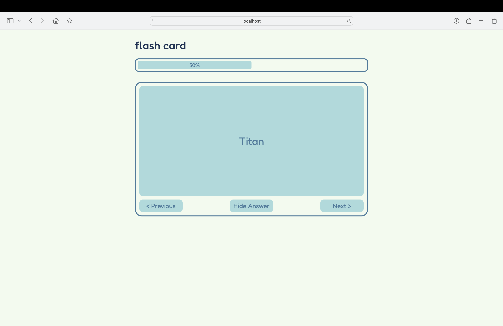

# Flash Cards - A React Study App

## Project Overview
This is a single-page application built using React designed to help users study and test their knowledge using digital flashcards. Inspired from https://roadmap.sh/projects/flash-cards
## Features
- Pre-defined flashcards with questions and answers
- Progress bar to show the user's progress
- Ability to view flashcards one at a time and flip to reveal the answer
- Simple navigation to cycle through the flashcards
## Screenshots


## How to run locally
- Open terminal and run ```cd ~/Desktop``` or cd to any folder of your choice.
- Run ```git clone https://github.com/vahenoorsingh/Flash-Cards.git```
- Run ```npm install```
- Run ```npm run dev```
- Open the link in your browser indicated in your terminal
